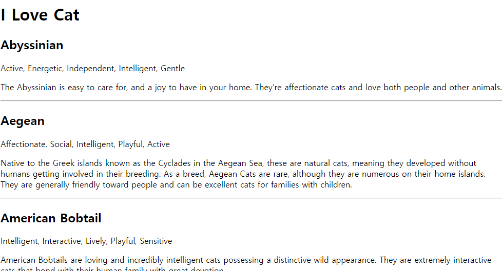

# ILC(I Love Cat) - Vuex-ORM-Axios Example


[](https://app.fossa.com/projects/git%2Bgithub.com%2Fmcauto%2Fvuex-orm-practice?ref=badge_shield)

Practice project

## Run

```bash
$ yarn install --dev
$ yarn serve
yarn run v1.19.0
$ vue-cli-service serve
 INFO  Starting development server...
98% after emitting CopyPlugin

 DONE  Compiled successfully in 2393ms    11:58:02 AM


  App running at:
  - Local:   http://localhost:3030/
  - Network: http://{network_ipaddr}:3030/

  Note that the development build is not optimized.
  To create a production build, run yarn build.
```

## References

[vuex-orm](https://github.com/vuex-orm/vuex-orm)

[vuex-orm/plugin-axios](https://github.com/vuex-orm/plugin-axios)


## License
[](https://app.fossa.com/projects/git%2Bgithub.com%2Fmcauto%2Fvuex-orm-practice?ref=badge_large)